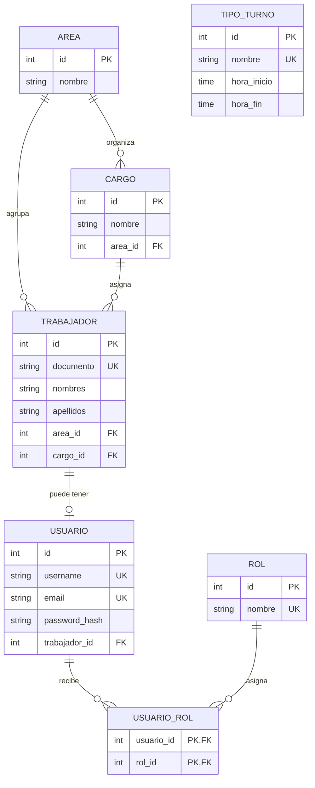

# Esquema de base de datos — Fase 1

Motor: **MySQL** (vía SQLAlchemy + PyMySQL). Los tipos usados son compatibles también con SQLite,
lo que permite ejecutar las pruebas automatizadas sin necesidad de una instancia MySQL real.

## Tablas

### `areas`
| Columna       | Tipo         | Restricciones                  |
|---------------|--------------|---------------------------------|
| id            | INT PK       | autoincrement                   |
| nombre        | VARCHAR(100) | UNIQUE, NOT NULL, index         |
| descripcion   | VARCHAR(255) | NULL                             |
| activo        | BOOLEAN      | NOT NULL, default true          |

### `cargos`
| Columna       | Tipo         | Restricciones                              |
|---------------|--------------|----------------------------------------------|
| id            | INT PK       | autoincrement                                |
| nombre        | VARCHAR(100) | NOT NULL, index                              |
| descripcion   | VARCHAR(255) | NULL                                          |
| area_id       | INT FK       | → `areas.id`, ON DELETE SET NULL, NULL       |
| activo        | BOOLEAN      | NOT NULL, default true                       |

### `roles`
| Columna       | Tipo         | Restricciones             |
|---------------|--------------|-----------------------------|
| id            | INT PK       | autoincrement                |
| nombre        | VARCHAR(50)  | UNIQUE, NOT NULL, index      |
| descripcion   | VARCHAR(255) | NULL                          |

Roles base sembrados en Fase 1: `Administrador`, `Trabajador`.

### `usuario_rol` (asociación N:M)
| Columna     | Tipo   | Restricciones                                   |
|-------------|--------|---------------------------------------------------|
| usuario_id  | INT FK | → `usuarios.id`, ON DELETE CASCADE, PK compuesta   |
| rol_id      | INT FK | → `roles.id`, ON DELETE CASCADE, PK compuesta      |

### `tipos_turno`
| Columna       | Tipo         | Restricciones             |
|---------------|--------------|-----------------------------|
| id            | INT PK       | autoincrement                |
| nombre        | VARCHAR(50)  | UNIQUE, NOT NULL, index      |
| hora_inicio   | TIME         | NOT NULL                     |
| hora_fin      | TIME         | NOT NULL                     |
| descripcion   | VARCHAR(255) | NULL                          |
| color         | VARCHAR(20)  | NULL                          |
| activo        | BOOLEAN      | NOT NULL, default true       |

### `trabajadores`
| Columna           | Tipo         | Restricciones                              |
|-------------------|--------------|----------------------------------------------|
| id                | INT PK       | autoincrement                                |
| documento         | VARCHAR(30)  | UNIQUE, NOT NULL, index                      |
| nombres           | VARCHAR(100) | NOT NULL                                      |
| apellidos         | VARCHAR(100) | NOT NULL                                      |
| fecha_nacimiento  | DATE         | NULL                                          |
| fecha_ingreso     | DATE         | NULL                                          |
| telefono          | VARCHAR(30)  | NULL                                          |
| area_id           | INT FK       | → `areas.id`, ON DELETE SET NULL, NULL       |
| cargo_id          | INT FK       | → `cargos.id`, ON DELETE SET NULL, NULL      |
| activo            | BOOLEAN      | NOT NULL, default true                       |

### `usuarios`
| Columna         | Tipo         | Restricciones                                        |
|-----------------|--------------|----------------------------------------------------------|
| id              | INT PK       | autoincrement                                             |
| username        | VARCHAR(50)  | UNIQUE, NOT NULL, index                                   |
| email           | VARCHAR(120) | UNIQUE, NOT NULL, index                                   |
| password_hash   | VARCHAR(255) | NOT NULL (bcrypt)                                         |
| activo          | BOOLEAN      | NOT NULL, default true                                    |
| trabajador_id   | INT FK       | → `trabajadores.id`, UNIQUE, ON DELETE CASCADE, NOT NULL  |

## Relaciones

- `Area` 1—N `Cargo`, `Area` 1—N `Trabajador`
- `Cargo` 1—N `Trabajador`
- `Trabajador` 1—1 `Usuario` (un trabajador puede no tener usuario; un usuario siempre pertenece a un
  único trabajador — `trabajador_id` es `UNIQUE`)
- `Usuario` N—M `Rol` a través de `usuario_rol`

## Diagrama de relaciones

El diagrama separa dos conceptos que suelen confundirse:

- **Trabajador**: persona que trabaja en la organización, tenga o no acceso al sistema.
- **Usuario**: cuenta para iniciar sesión; cada cuenta pertenece a un único trabajador.



### Cómo leerlo

- Un **área** (por ejemplo, *Operaciones*) puede tener varios cargos y trabajadores.
- Un **cargo** (por ejemplo, *Supervisor*) puede ser asignado a varios trabajadores.
- Cada **trabajador** puede tener **cero o una cuenta de usuario**. Esto permite registrar personas que
  todavía no necesitan ingresar a la aplicación.
- Un **usuario** puede recibir uno o varios **roles** (por ejemplo, *Administrador* y *Trabajador*).
  La tabla `usuario_rol` registra esas asignaciones.
- Un **tipo de turno** (por ejemplo, *Diurno* o *Nocturno*) se administra de forma independiente en
  esta fase; se conectará con la programación de turnos en fases posteriores.

## Creación del esquema

Dos alternativas, según la fase de desarrollo:

1. **Rápida (recomendada en Fase 1)**: `python -m app.db.init_db` crea todas las tablas con
   `Base.metadata.create_all()` y siembra los roles base + un usuario administrador (`admin` /
   `Admin123!`, **cambiar en producción**).
2. **Migraciones (Alembic)**: el proyecto incluye `alembic.ini` y `alembic/env.py` configurados para leer
   la URL de conexión desde `app.config.settings` y la metadata desde `app.db.session.Base`. Para
   generar la migración inicial contra una base de datos real:

   ```bash
   alembic revision --autogenerate -m "esquema inicial"
   alembic upgrade head
   ```
